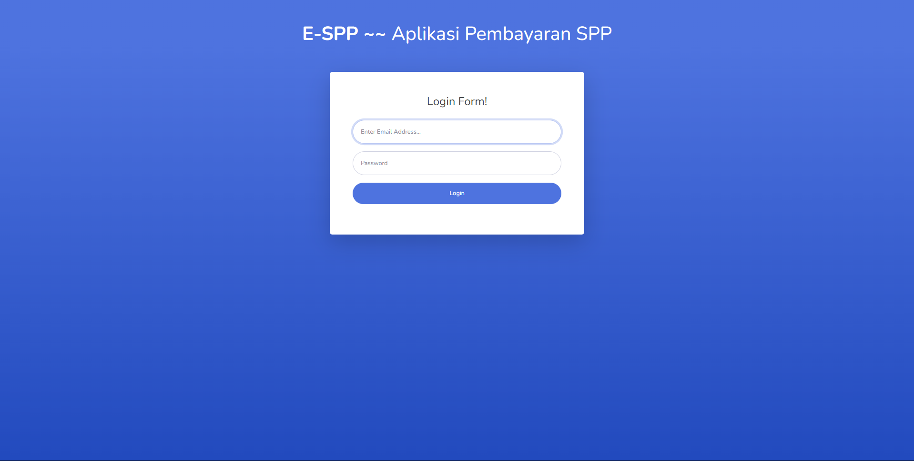
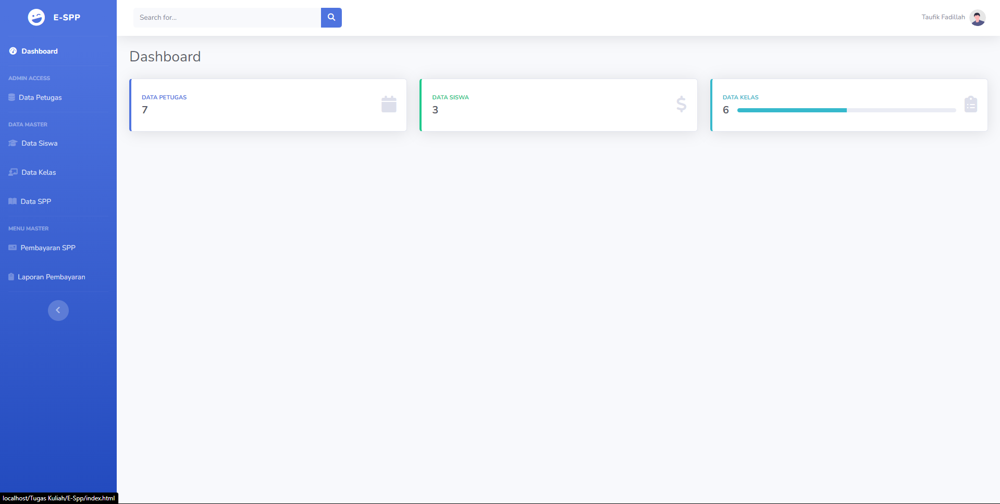
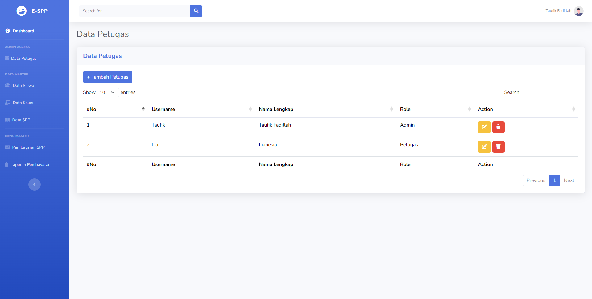
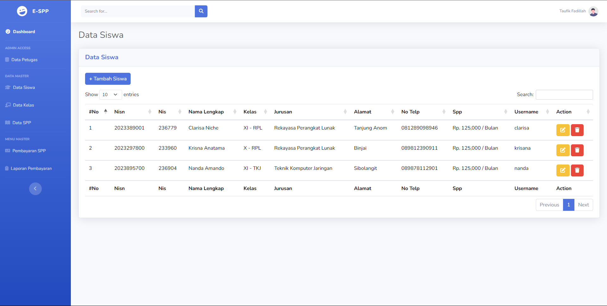
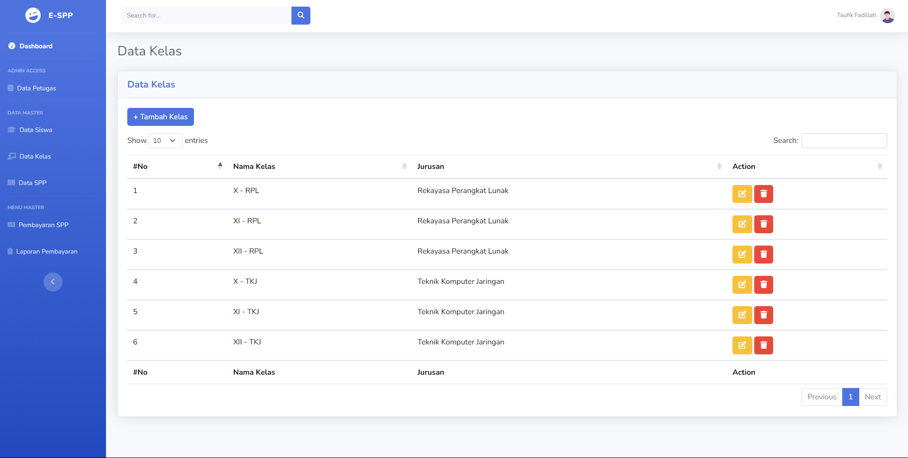
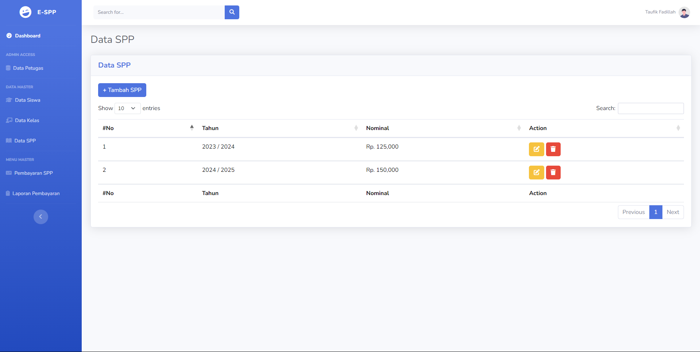
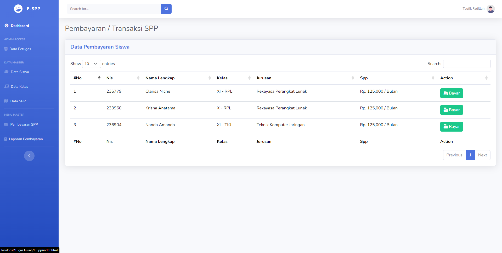
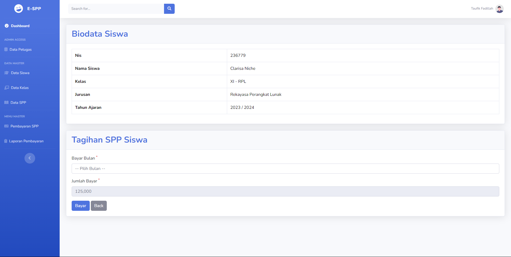
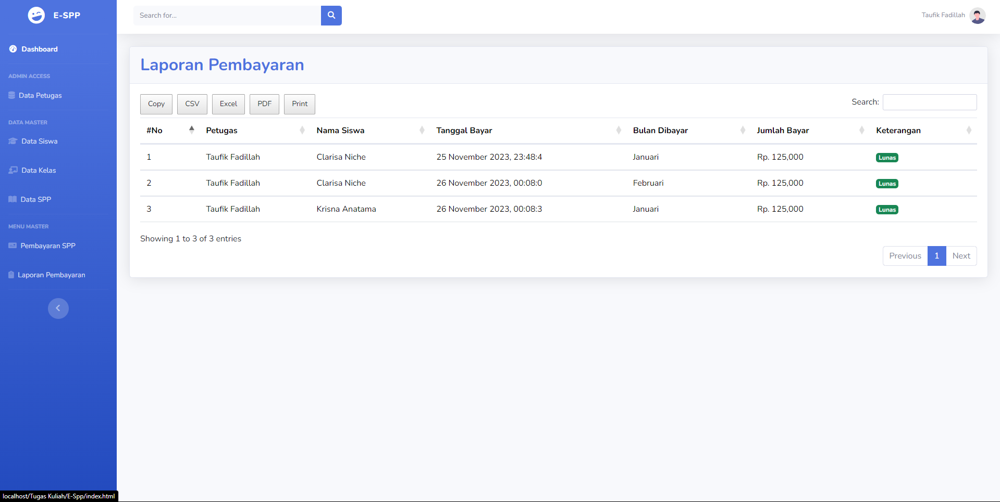

# Aplikasi Pembayaran SPP ~ PHP OOP PDO, MySQL

Simpel Aplikasi Pembayaran SPP Berbasis WEB dengan PHP 8.2 dan MySQL, **Dari Tugas Kuliah**

## Tech Stack

- PHP 8.2
- MySQL
- SB Admin 2
- DataTables - jQuery

## Fitur

- Login / Logout
- Multi Login (Admin, Petugas, Siswa)
- CRUD Petugas
- CRUD Siswa
- CRUD Kelas
- CRUD Spp
- Transaksi Pembayaran
- Laporan Pembayaran
- Export PDF, EXCEL, CSV, COPY, PRINT

## Support Me

